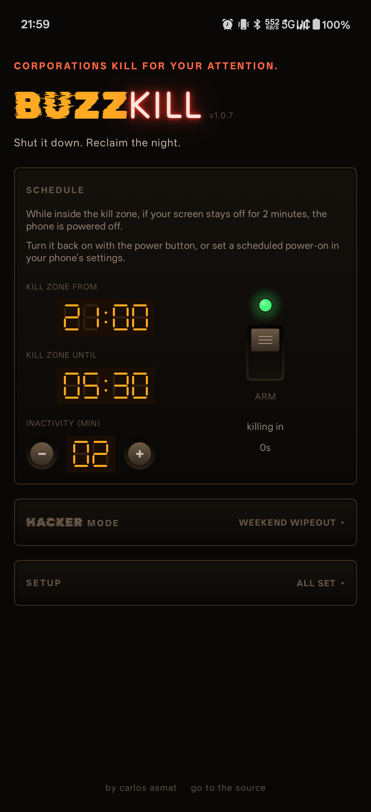

# BuzzKill



Android app that powers off the phone after an inactivity timeout, only inside a configurable nightly kill zone. Single-screen, Winamp-style hardware-panel UI. Pre-built APKs for every tagged version live on the [releases page](https://gitlab.com/sotilrac/buzz-kill/-/releases).

Primary target: **OnePlus 11 (OxygenOS)**. The code keeps OEM specifics in `app/src/main/kotlin/ca/asmat/buzzkill/oem/` so adding Pixel, Samsung, Xiaomi, etc. is a data-only change.

## Why this exists

The phone wakes you up. Notifications, the temptation to scroll, the buzz at 2am. BuzzKill kills the phone instead. Inside a kill zone you set (e.g. 23:00–06:00), the app waits for the screen to stay off for N minutes, then triggers the system shutdown via the accessibility service. To come back on in the morning, use the built-in scheduled power-on (Settings → Additional settings → Scheduled power on/off on OnePlus).

## Install

On your phone, open the [releases page](https://gitlab.com/sotilrac/buzz-kill/-/releases) and download the latest `buzzkill-vX.Y.Z.apk` asset from the most recent release. Open the file from the download notification or your file manager, and confirm the install. The first time you do this, Android will prompt you to allow installs from the source app (browser or file manager); the toggle lives at Settings, Apps, Special app access, Install unknown apps. After install, walk through the onboarding checklist (see [After install: permission walkthrough](#after-install-permission-walkthrough) below) before the app can do anything useful.

## Host dependencies

You need these on your dev machine before opening the project.

### JDK

Android Gradle Plugin 8.x needs JDK 17. AGP 9.x needs JDK 21. We're on AGP 8.x for now.

```bash
sudo apt install openjdk-17-jdk
java -version   # confirm 17.x
```

Or via [SDKMAN](https://sdkman.io/) if you want to juggle multiple JDKs:

```bash
curl -s "https://get.sdkman.io" | bash
sdk install java 17.0.13-tem
```

### Android Studio

Install the latest stable from <https://developer.android.com/studio>. As of May 2026 that's the Otter / Panda 4 release line. Android Studio bundles a compatible Gradle and Kotlin.

On Linux, the easiest path is the JetBrains Toolbox or the official `.tar.gz`. Snap and Flatpak versions exist but tend to lag.

### Android SDK components

Open Android Studio → SDK Manager and install:

- **SDK Platforms**: Android 15 (API 35) — required, this is our `targetSdk`. Android 16 (API 36) optional.
- **SDK Tools**:
  - Android SDK Build-Tools 35.x
  - Android SDK Platform-Tools (`adb`, `fastboot`)
  - Android SDK Command-line Tools (latest)

Make sure `~/Android/Sdk/platform-tools` is on your `PATH` so `adb` works from a terminal:

```bash
echo 'export PATH="$HOME/Android/Sdk/platform-tools:$PATH"' >> ~/.bashrc
```

### Optional but helpful

- **`scrcpy`** — mirror your phone screen on the desktop while testing the dim-room UI without unlocking constantly:
  ```bash
  sudo apt install scrcpy
  ```
- **`adb` over Wi-Fi** — see device setup below.

## Device setup (OnePlus 11)

1. Open `Settings → About device → Version`. Tap **Build number** seven times. Enter your PIN. Developer Options is now unlocked.
2. `Settings → System → Developer options`:
   - Enable **USB debugging**.
   - Enable **Wireless debugging** if you want to flash without a cable.
3. Plug the phone into your machine over USB. Approve the RSA fingerprint prompt on the phone.
4. Confirm `adb` sees it:
   ```bash
   adb devices
   ```
   You should see one device listed as `device` (not `unauthorized`).

For wireless debugging, on the phone open **Wireless debugging → Pair device with pairing code**, then on the desktop:

```bash
adb pair <ip>:<pair-port>           # use the code shown on the phone
adb connect <ip>:<connect-port>
```

## Project bring-up

Once dependencies are installed:

```bash
git clone <this-repo-url> buzz-off
cd buzz-off
# Open in Android Studio. Let the Gradle sync complete.
# Plug in the OnePlus 11. Click Run.
```

The first sync will download Gradle, the AGP, Kotlin, and the Compose libraries. It can take a few minutes.

### Note on the Gradle wrapper

The repo ships `gradle-wrapper.properties` but not the wrapper jar / `gradlew` script. Two ways to get them:

- **Easiest**: open the project in Android Studio. It detects the missing wrapper, prompts to import, and bootstraps it for you.
- **From CLI**: install Gradle once (e.g. `sdk install gradle 8.11.1` via SDKMAN), then in the repo run `gradle wrapper --gradle-version 8.11.1`. Commit the resulting files.

## After install: permission walkthrough

The app shows an onboarding checklist on first launch. Each row deep-links to the right system surface and re-verifies when you return.

1. **Accessibility service.** OnePlus puts this at `Settings → Additional settings → Accessibility → Installed services → BuzzKill`. Toggle it on. This is the mechanism the app uses to power off; without it nothing else works.
2. **Disable battery optimization for BuzzKill.** OxygenOS will otherwise kill the foreground service while the screen is off and the timer never fires.
3. **Notification permission.** Android 13+ requirement. The persistent notification while the kill zone is active needs this.
4. **Scheduled power on/off.** This is the **mitigation for the "phone won't come back on" risk**. Set the phone to auto-power-on around your wake time:
   - `Settings → Additional settings → Scheduled power on/off`
   - Enable the power-on schedule. Suggested: 5 minutes after the kill zone ends.
   - The app cannot configure this on your behalf and cannot verify it; it's a checkbox you confirm yourself. If you forget it, the phone won't wake up by itself.

A first-shutdown confirmation dialog also appears the very first time the inactivity timer fires, so you can't get caught unaware.

## OnePlus and aggressive battery management

OxygenOS is moderately aggressive about killing background work. See <https://dontkillmyapp.com/oneplus> for the canonical advice. In short:

- Disable battery optimization for BuzzKill (covered in onboarding).
- Lock BuzzKill in Recents (long-press in Recents → padlock icon) so OxygenOS doesn't sweep it.
- Don't enable "Deep Optimization" or "Advanced Optimization" battery modes for this app.

## Testing the shutdown mechanism without losing your work

The app includes a **Test trigger** with a 10-second cancellable countdown that runs the shutdown sequence in dry-run mode by default. It opens the system power dialog, finds the matching node, and Toasts what it would have tapped — without actually tapping. Use this after install to verify that the OnePlus power-dialog strings still match.

## Troubleshooting

### "Test trigger says: 'No match. Visited (X nodes): [...]'"

The OnePlus power dialog uses different text on your firmware than what's hardcoded in `oem/PowerDialogStrings.kt`. The Toast lists the first 8 visited node texts, so you'll see what the dialog actually contains. Add the exact string (lowercased) to the OnePlus row in that file and rebuild. If you see the right strings (e.g. "Power off") but no match, the comparison is case-sensitive on the file side; everything is normalised before matching, so this shouldn't happen.

### "Test trigger says: 'Power dialog did not open'"

The accessibility service isn't actually enabled, or it crashed. Re-toggle it under `Settings → Additional settings → Accessibility → Installed services → BuzzKill`. Watch `adb logcat -s BuzzKill.svc:* BuzzKill.alarm:* BuzzKill.poweroff:*` for clues.

### Foreground notification disappears after a while on OxygenOS

OxygenOS swept the app despite battery optimization being off. Try:

- Lock BuzzKill in Recents (the padlock).
- `Settings → Battery → Battery optimization → BuzzKill → Don't optimize`.
- `Settings → Apps → BuzzKill → Battery → Allow background activity`.
- See <https://dontkillmyapp.com/oneplus> for the latest workarounds.

### Phone shut down but didn't wake up

The OEM scheduled-power-on isn't enabled. Open `Settings → Additional settings → Scheduled power on/off` and turn the **Power on** schedule on. There is no API to verify or set this from the app side.

### Inactivity alarm fires while I'm using the phone

The screen-off broadcast started the timer and only `ACTION_USER_PRESENT` (a real keyguard dismiss) cancels it. If you're on the lockscreen for an extended time it can still fire — add a quick unlock + relock to interrupt.

## Viewing logs

Plug the phone in over USB, accept the RSA prompt, then use `adb logcat`. Useful invocations:

### Live tail of just BuzzKill

Most useful while testing. Streams everything the app logs in real time:

```bash
adb logcat -c                          # clear the buffer first
adb logcat 'BuzzKill.*:V' '*:S'        # follow only BuzzKill tags
```

`'*:S'` silences everything else; without it you'd be drowned in system noise.

### One-shot dump after the fact

If you reproduced an issue and want to inspect what already happened (don't need a live tail):

```bash
adb logcat -d 'BuzzKill.*:V' '*:S' | tail -100
```

`-d` exits immediately after dumping the current buffer instead of following.

### Crash-only buffer

Android keeps fatal crashes in a separate ring. If the app died unexpectedly:

```bash
adb logcat -d -b crash | tail -120
```

This is where stack traces from `FATAL EXCEPTION` land. Useful when the app starts and immediately closes.

### Specific subsystem

Each module has its own tag:

| Tag | What it covers |
|---|---|
| `BuzzKill.svc` | Accessibility service: kill-zone state, user-present, broadcast routing |
| `BuzzKill.alarm` | AlarmManager scheduling and re-arms |
| `BuzzKill.poweroff` | Power-off sequence: node walking, slide gesture, retries |
| `BuzzKill.inactivity` | Manifest receiver that wakes the process when the alarm fires |
| `BuzzKill.fgs` | Foreground service start/stop |
| `BuzzKill.boot`, `BuzzKill.replaced` | BOOT_COMPLETED / package-replaced re-arm |

Filter to just one:

```bash
adb logcat 'BuzzKill.poweroff:V' '*:S'
```

### Targeting a specific device

If multiple devices/emulators are connected:

```bash
adb devices                                # list serials
adb -s <serial> logcat 'BuzzKill.*:V' '*:S'
```

### What "good" looks like for an inactivity-fired shutdown

```
AlarmManager: sending alarm ... action ca.asmat.buzzkill.action.INACTIVITY_FIRED
BuzzKill.inactivity: inactivity broadcast received
BuzzKill.inactivity: running shutdown (emulator=false)
BuzzKill.poweroff: running power-off sequence (dryRun=false)
BuzzKill.poweroff: slide-down dialog detected via marker: 'two fingers to power it off'
BuzzKill.poweroff: slide attempt 1/3
BuzzKill.poweroff: slide-down completed
BuzzKill.poweroff: dialog dismissed after attempt 1 — assuming triggered
BuzzKill.svc: external shutdown trigger result (dryRun=false): Triggered(...)
```

If you see `inactivity broadcast received` missing entirely after the AlarmManager line, OxygenOS killed the app and didn't wake it for the broadcast — check OEM auto-launch / battery-killer settings.

If you see `slide attempt 3/3` followed by `slide-down dispatched 3× but dialog still visible`, the gesture isn't engaging the OnePlus slider — likely the lockscreen is intercepting it.

## CI / CD

`.gitlab-ci.yml` runs only on `v`-prefixed tag pushes. Branch pushes get no pipeline; run the checks locally with `make verify`. A tag pipeline has three stages:

1. **verify**: `ktlintCheck`, `detekt`, Android Lint, and unit tests. JUnit results show up in the GitLab pipeline UI; lint/ktlint/detekt reports attach as job artifacts.
2. **build-release**: asserts the tag matches the `versionName` in `app/build.gradle.kts`, then builds a signed release APK and uploads `buzzkill-<tag>.apk` to the GitLab Generic Package Registry.
3. **release**: creates a GitLab Release entry on the tag with the APK attached as an asset link.

### Cutting a release

`versionCode`/`versionName` are plain literals in `app/build.gradle.kts` (so F-Droid's checkupdates can parse them). Bump both, commit, then tag the same commit. The tag must match `versionName` or `build-release` fails:

```bash
# after bumping versionName = "1.0.9" and versionCode = 10009 in app/build.gradle.kts
git tag v1.0.9
git push origin main v1.0.9
```

### Signing

Release APKs are signed with a stable release keystore. The signing config in `app/build.gradle.kts` activates only when the `BUZZKILL_*` Gradle properties are present, so local debug builds and the F-Droid build (which re-signs with its own key) still produce an unsigned release APK instead of failing.

Generate a keystore once and back it up outside the repo (lose it and you can never ship an in-place update again):

```bash
keytool -genkeypair -v -keystore buzzkill-release.jks -alias buzzkill \
  -keyalg RSA -keysize 4096 -validity 10000
```

To sign locally, add the four `BUZZKILL_*` properties to `~/.gradle/gradle.properties` (never commit them): `BUZZKILL_STORE_FILE` (absolute path), `BUZZKILL_STORE_PASSWORD`, `BUZZKILL_KEY_ALIAS`, `BUZZKILL_KEY_PASSWORD`.

For CI, protect the `v*` tag pattern and set: `BUZZKILL_KEYSTORE_BASE64` (from `base64 -w0 buzzkill-release.jks`), plus the three passwords/alias as `ORG_GRADLE_PROJECT_BUZZKILL_*` variables (the prefix maps them to the Gradle properties). `build-release` decodes the keystore before running `assembleRelease`.

Changing the key breaks in-place updates: users on the old key must uninstall first. F-Droid signs with its own key regardless.

### Local equivalents

A `Makefile` wraps the common tasks (`make help` lists them all):

```bash
make verify          # compile + detekt + unit tests (fast pre-commit loop)
make lint            # ktlint + detekt + Android Lint
make test            # unit tests
make apk             # signed release APK (needs the BUZZKILL_* properties)
make apk-debug       # debug APK
make install-debug   # build + install debug on a connected device
make hooks           # install the lefthook git hooks
```

## Uninstall

```bash
adb uninstall ca.asmat.buzzkill
```
